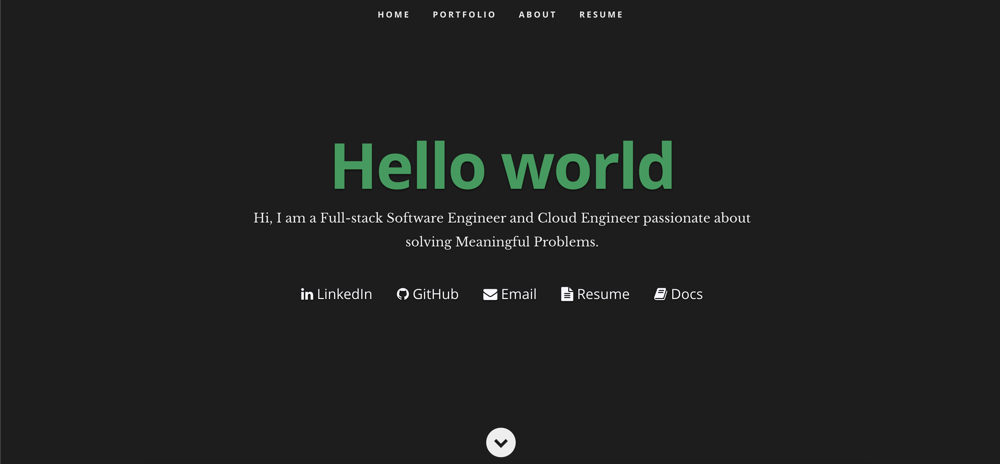
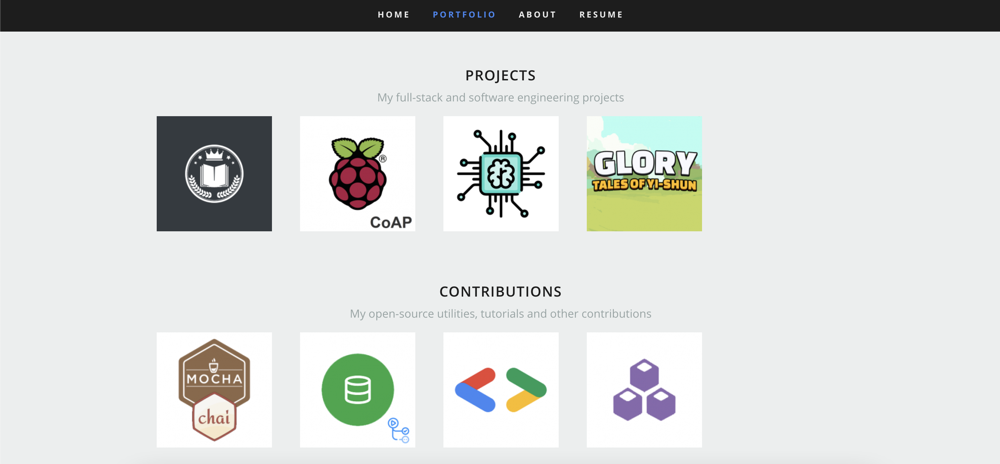
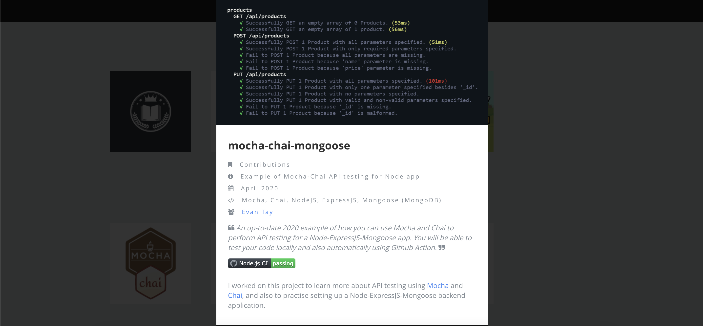
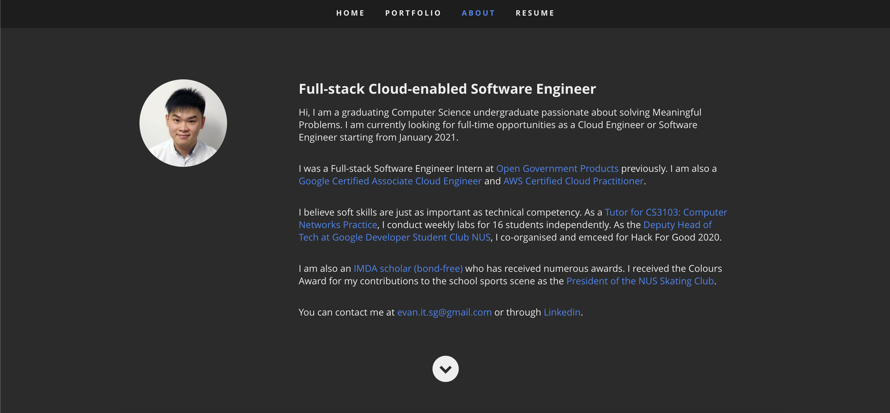
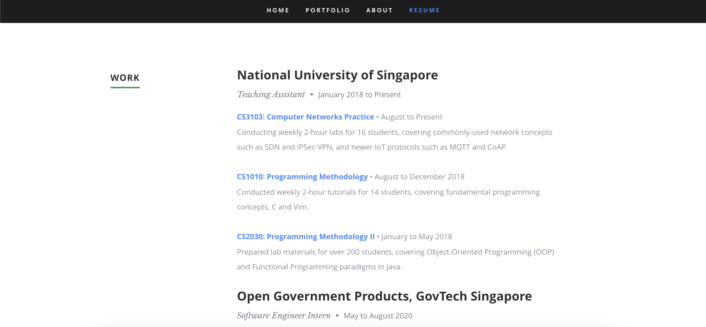

# Note

This was my personal portfolio website between 2017 and 2020. It was available at [www.evantay.com](https://evantay.com/). It has since been replaced by a newer [Docusaurus v2](https://v2.docusaurus.io/) powered version: [kaya-folio](https://github.com/DigiPie/kaya-folio).

It was hosted on a [DigitalOcean](digitalocean.com) Droplet and powered by [Grav](https://getgrav.org/), an open source flat-file Content Management System (CMS) powered by PHP. I used a heavily modified version of the [Ceevee](https://github.com/getgrav/grav-theme-ceevee) one-page theme as you can see below.

This project has been archived given that I no longer plan to update it anymore.

## Landing

## Portfolio

## About

## Resume

